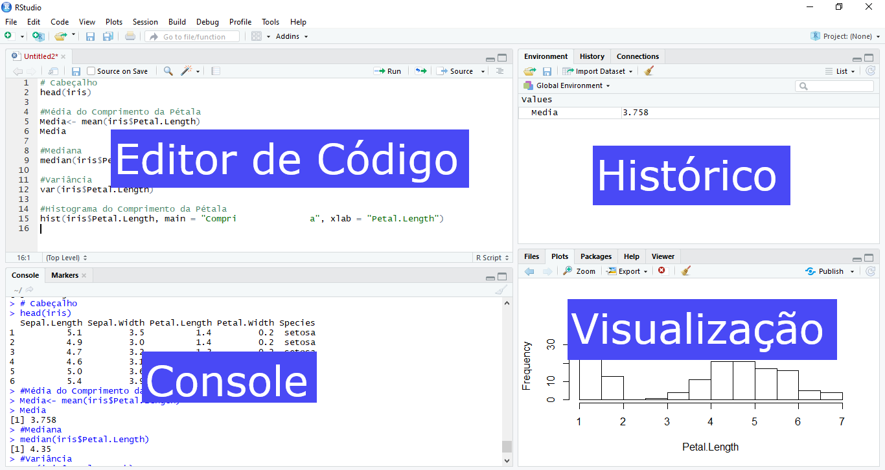

# Introdução

## Contextualizando a linguagem de programação R

A linguagem R é uma linguagem de programação com o foco em computação estatística e manipulação de gráficos. Criada no início dos anos 90 por [Geroge Ross Ihaka](https://en.wikipedia.org/wiki/Ross_Ihaka) e [Robert Clifford Gentleman](https://en.wikipedia.org/wiki/Robert_Gentleman_(statistician)), o R é usado mais utilizado por estatísticos, bioinformatas, analistas de dados e desenvolvedor de *software* estatístico. No entanto ele tem se destacado na comunidade científica. Em maio de 2023, o R ocupava a 16ª posição no [índice TIOBE](https://www.tiobe.com/tiobe-index/), uma medida de popularidade da linguagem de programação, sendo que em agosto de 2020 o R atingiu seu pico em ficando 8º lugar. 

O R é um ambiente de *software* livre de código aberto, disponível sob a [*GNU General Public License*](https://en.wikipedia.org/wiki/GNU_General_Public_License). Seus executáveis pré-compilados são fornecidos para vários sistemas operacionais. Ele tem uma interface de linha de comando, mas também possui interfaces gráficas de usuário (GUI) de terceiros como o [Rstudio](https://posit.co/download/rstudio-desktop/) - que será a IDE (*Integrated Development Envirenment*) que iremos utilizar na apostila.

## Instalação do R
1. Acesse o repositório do R ([clique aqui](https://cran-r.c3sl.ufpr.br/)).
2. Acesse o link referente ao seu sitema operacional: Linux, macOS ou Windows.
2.1. Linux: escolha a distribuição linux (debian, fedora, redhat, suse ou ubuntu) e então prossiga com os comandos no terminal.
2.2. macOS: escolha o instalador conforme o modelo da sua máquina e execute-o.
2.3. Windows: acesse o link Base e então baixe o instalador e execute-o.

## Instalação do RStudio
1. [Clique aqui](https://posit.co/download/rstudio-desktop/) para acessar o repositório do RStudio.
2. Baixe o instalador conforme o sistema operacional da sua máquina (Linux/macOS/Windows).

## Interface do RStudio
Por padrão o RStudio abre quatro janelas (pode ocorrer de uma estar oculta, mas observe o botão de minimizar/maximizar no canto superior direito de cada janela).

* __Editor de código__ (_janela do canto superior esquerdo_): Nela você digita os comando a serem executados no RStudio. Para executá-los aperte as teclas 'CTRL' e 'ENTER' simultaneamente na linha ou bloco de código selecionado.
* __Console__ (_janela do canto inferior esquerdo_): É visto as saídas dos comandos que são rodados. Também é possível digitar e rodar códigos diretamente nesta janela.
* __Histórico__ (_janela do canto superior direito_): Nesta janela ficam salvos os objetos, históricos de comandos e conexões com outros aplicativos.
* __Visualização__ (_janela do canto inferior direito_): Aqui você pode visualizar os gráficos no RStudio, navegar entre os arquivos do seu computador, visualizar os pacotes instalados e ver a ajuda de comandos e descrições de tabelas de dados e por fim navegar entre os arquivos html.



## Pacotes
Por ser *Open Source*, o R permite que qualquer usuário disponibilize funções e bancos de dados a comunidade. As funções/bancos de dados são disponibilizados através de pacotes. A instalação de um pacote depende do repositório que ele está armazenado: máquina local, CRAN, GitHub, Bioconductor, entre outros. O repostitório CRAN contêm muitos pacotes e não é direcionado à uma área específica (como é o caso do Bioconductor que se destina a pacotes voltados para área de biotecnologia). A instalação de um pacote do repositório CRAN é feita pelo menu "Tools > Install Packages" ou simplesmente utilizando o seguinte comando:
```{r eval=FALSE}
installed.packages("nomeDoPacote")
```

Para que você possa utilizar as funções do pacote que instalou, você deve usar um dos dois comandos a seguir, para de fato carregar as funções do pacote para o ambiente R:
```{r eval=FALSE}
library(nomeDoPacote)
require(nomeDoPacote)
```

A função `library()` é utilizada normalmente no corpo do script, enquanto que a função `require()` é utilizada dentro de outras funções.

## Começando de fato a programar em R
No console (janela do canto inferior esquerdo) digite o comando a seguir e tecle ENTER:
```{r eval=FALSE}
print("Hello World")
```

Agora digite o mesmo comando no editor de código (janela do canto superior esquerdo) e com o cursor na mesma linha do comando, tecle CTRL e ENTER simultaneamente:
```{r eval=FALSE}
print("Hello World")
```

A diferença é que quando executamos os comandos no editor de código, o comando continua no editor para ser executado, ou seja svocê está construindo um script. Mas você executa comando diretamente no console, eles não ficam gravados em um editor.

O dado de saída da função, foi um print do que estava dentro da função. Mas como você saber o que usar dentro de uma determinada função, como `print()`? Você precisa acessar o manual desta função.

## Acessando o manual da função
Esta é uma etapa muito importante que antecede a sua caminhada no aprendizado do R. Você pode visualizar o manual da função executando um comando onde um ponto de interregoção (?) precisa anteceder a função:
```{r eval=FALSE}
?print
```

Mas se você deseja encontrar funções que realizam uma determinada ação, basta inserir dois pontos de interrogação antecedendo a ação desejada:
```{r eval=FALSE}
??priting
```
O comando acima realizará uma busca por tópicos que contenham a palavra *ploting*. Outra opçõe alternativa ao **?** é o uso da função `help()` e `help.search()` para **??** 
```{r eval=FALSE}
help("print")
help.search("priting")
```

Algumas funções possuem exemplos de sua execução. Se você quer saber como utilizar uma determinada função através de exemplos, execute a função `example()`.
```{r eval=FALSE}
example("print")
```

## Comentando códigos no R

A maioria das linguagens de programação e até linguagem de marcação, possuem uma forma de inserção de textos que não serão executados pela linguagem. Esse procedimento é denominado de comentário. Você pode comentar os seus códigos. Isso é algo essencial para todos os programadores, indiferente da linguagem. Pois, códigos comentados facilitam a interpretação do mesmo por outros programadores e até mesmo pelo autor, devido a um período de tempo que se passou desde a criação daquele código.

Para comentar linhas no R você precisa inserir o `#` antes do que seria o comentário:
```{r eval=FALSE}
# isto é um comentário
```

Exemplo aplicado:
```{r eval=FALSE}
print("Hello World") # imprimindo na tela Hello World
```

Perceba que o conteúdo após o `#` não é interpretado no R, ou seja, este conteúdo é um comentário.
