# Gráficos

## Gráficos no R
Um dos maiores pontos fortes do R é sua capacidade de visualização dos dados. Existem pacotes especializados que oferecem excelentes recursos de visualização mesmo de elementos complexos. Além disso, existe a possibilidade de geração de gráficos em 3D, gráficos interativos e por fim a aplicação desses gráficos em relatórios (como no Rmarkdown) ou em dashboards ou web apps (como no Shiny).

Nesse capítulo, iremos ensinar os princípios básicos na criação de gráficos, inicialmente utilizando os pacotes básicos do R para em seguida avançarmos no pacote ggplot2. Esse pacote faz parte do conjunto de bibliotecas do tidyverse e apresenta uma sintaxe dos gráficos que facilita a manipulação ou sobreposição de elementos. Além disso, o ggplot2 é compatível com uma série de outros pacotes os quais permitem integrá-lo para as mais diversas finalidades.

Para algumas aplicações específicas outros pacotes gráficos também podem ser utilizados como por exemplo o pheatmap ou ComplexHeatmap para a geração de mapas de calor mais complexos, os quais não iremos abordar por enquanto.

## Gráficos base em R
### Visualizando dados
Abra o RStudio e na janela de comando instale o pacote `ggplot2`. Após a instalação, carregue o pacote com a função library.
```{r eval=FALSE}
install.packages("ggplot2")
library(ggplot2)
```

Antes de conhecer o pacote ggplot2, para uma exploração rápida de dados em R as vezes é mais útil utilizar as funções básicas de plots no R. Essas funções básicas já vem previamente instaladas e não requerem a instalação de pacotes para serem utilizadas. No entanto, para fazer gráficos mais elaborados se torna mais fácil de usar o pacote ggplot2. Primeiramente vamos aprender a utilizar as funções básicas para a criação de plots em R para então, na segunda parte da aula passar a utilizar
as funções do pacote ggplot2.

### Criando gráficos de pontos
Basicamente para montar um gráfico de pontos basta usar a função plot() e passar como argumento os valores de x e y. Na janela de comando no RStudio digite o seguinte código:
```{r eval=FALSE}
plot(mtcars$wt, mtcars$mpg)
```

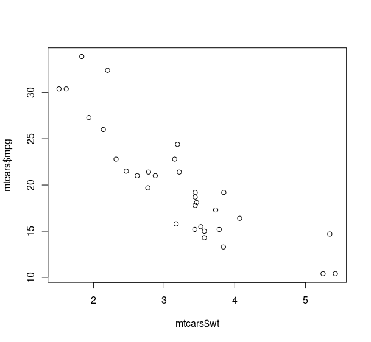
```{r eval=FALSE}
# com o ggplot2 faríamos
qplot(wt, mpg, data = mtcars)
```

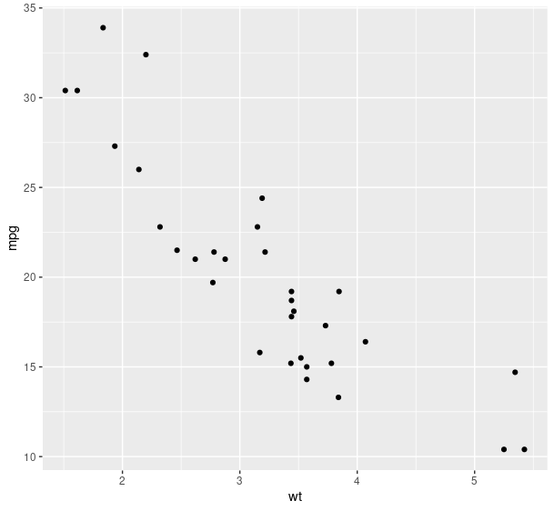

### Criando gráficos de linha
Para fazer um gráfico em linha com a função plot, basta adicionar um outro argumento a função. Na janela de comando (Console) digite o código abaixo e atente para o argumento type = “l”.
```{r eval=FALSE}
plot(pressure$temperature, pressure$pressure, type = "l")
```

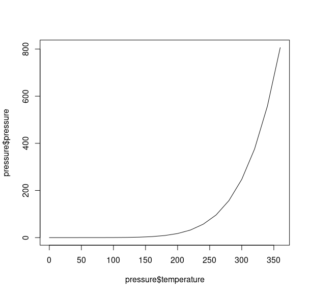

```{r eval=FALSE}
# para adicionar pontos e/ou múltiplas linhas, primeiramente
# faz se o uso de plot() para a primeira linha e então usa-se
# a função points() para pontos adicionais e lines() para
# linhas adicionais

plot(pressure$temperature, pressure$pressure, type = "l")
points(pressure$temperature, pressure$pressure)
lines(pressure$temperature, pressure$pressure/2, col = "red")
points(pressure$temperature, pressure$pressure/2, col = "red")
```

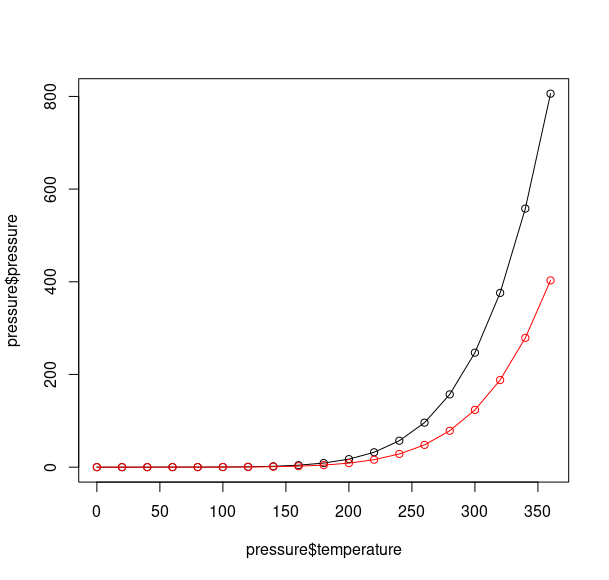

```{r eval=FALSE}
# com o pacote ggplot2 fazemos uso da
# função qplot(), concatenando linhas e pontos no mesmo vetor
# da seguinte forma

qplot(temperature, pressure, data = pressure, geom = c("line",
"point"))
```

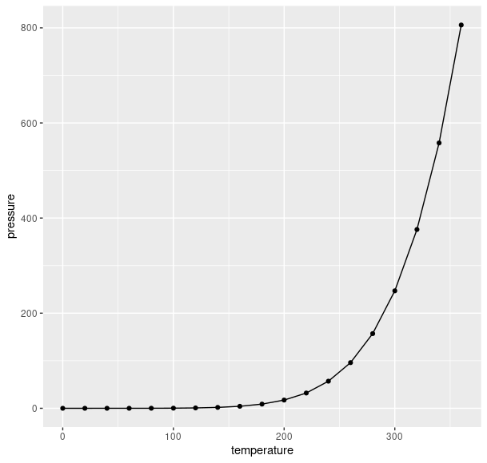

### Criando gráficos de barra
A função utilizada para criar gráficos em barra é a `barplot()` e é utilizada passando-se o vetor de valores para a altura de cada barra como argumento da função e de modo opcional, outro argumento que também é utilizado é o vetor de labels para cada barra. As vezes, gráficos em barra se referem a gráficos onde as barras representam a quantidade de casos em cada categoria. Para gerar a quantia de cada valor único em um vetor, usa-se a função `table()`.
```{r eval=FALSE}
table(mtcars$cyl)
##
## 4 6 8
## 11 7 14
# o que significa que há 11 casos do valor 4, 7 casos do
# valor 6 e 14 casos do valor 8
```

```{r eval=FALSE}
# para gerar um gráfico em barra dessas quantias basta passar
# como argumento para a função barplot()
barplot(table(mtcars$cyl))
```

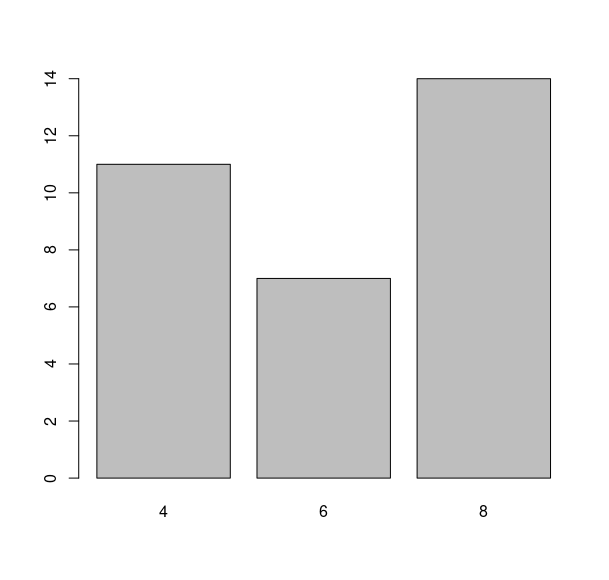

### Criando histogramas
Para histogramas faz-se uso da função `hist()` passando como argumento o vetor de valores.
```{r eval=FALSE}
hist(mtcars$mpg)
```

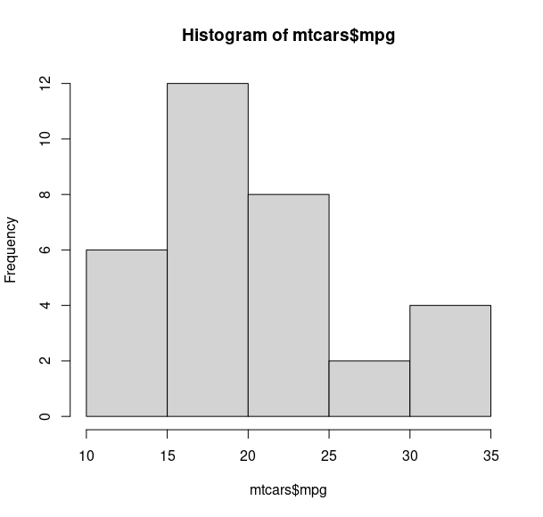

```{r eval=FALSE}
# para especificar o número de quebras usa-se o argumento
# breaks
hist(mtcars$mpg, breaks = 10)
```

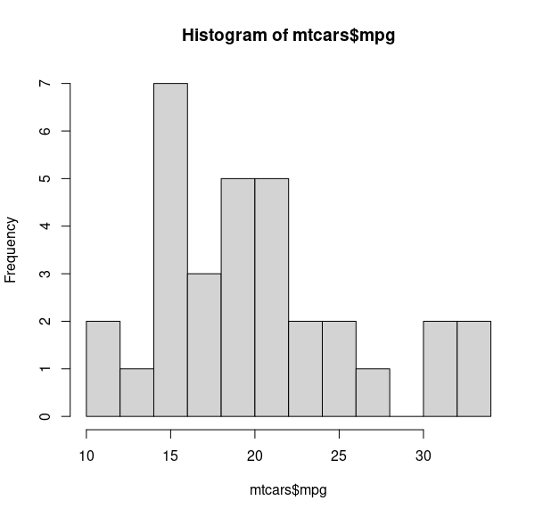

### Criando boxplot
O gráfico do tipo boxplot é utilizado para comparar distribuições. Utiliza-se uma fórmula de sintaxe para combinar as variáveis a serem analisadas.
```{r eval=FALSE}
boxplot(len ~ supp, data = ToothGrowth)
```

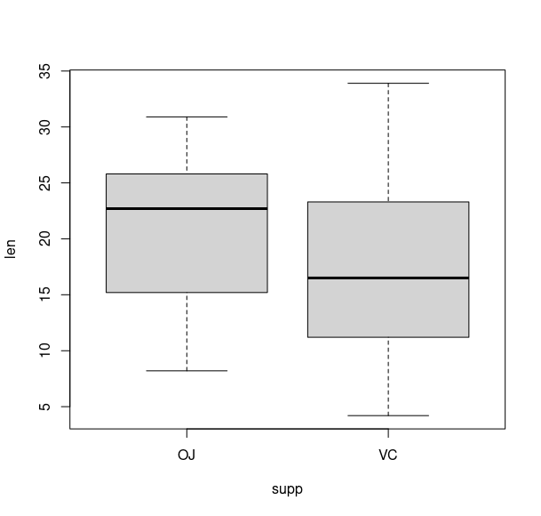

```{r eval=FALSE}
# outra forma de obter o mesmo gráfico com o pacote ggplot2 é
qplot(supp, len, data = ToothGrowth, geom = "boxplot")
```

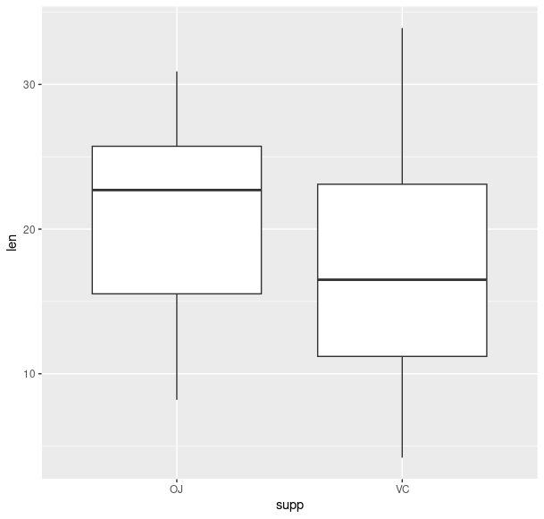

Ao longo desta primeira parte da aula pudemos observar que os gráficos em R são montados passo a passo. E que, caso se queira incrementar títulos, e especificar outros detalhes, isso pode ser feito com a adição de outros argumentos nas funções utilizadas para criar os gráficos. Para saber mais a respeito dos argumentos de cada função, basta fazer `?` seguido do nome da função ou através de `help(“nomedafuncao”)`.
```{r eval=FALSE}
# `?`(plot)
# help("plot")

data(mtcars)
head(mtcars)
plot(disp ~ mpg, data = mtcars, main = "My First Plot")
```

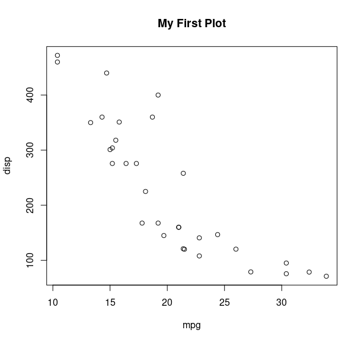

## Lista de exercícios 01
1. Utilizando o dataset cars, construa um gráfico com a função `plot()`. Mostre a
relação entre as variáveis distância (dist) e velocidade (speed). Como título do gráfico coloque “Relação entre distância e velocidade” e, para as labels do eixo x e y, “Velocidade (milhas por hora)” e “Distância percorrida (milhas)”, respectivamente. Os pontos do gráfico devem ser vermelhos.

2. A função `rnorm()` gera desvios aleatórios. Usando a ajuda, veja a documentação para essa função e exemplos de utilização. Comece com `rnorm(10)` e veja o que é retornado. Em seguida, usando a função `hist()` plote um histograma para visualizar a distribuição destes desvios aleatórios, agora com `rnorm(1000)`.

3. Utilizando o dataset airquality, use a função head() para ver quantas colunas
contém o data set. Para selecionar uma coluna específica do dataset, usamos a notação “\$”. Ou seja, se desejamos utilizar os dados contidos na camada “Ozone” devemos usar o seguinte comando airquality\$Ozone. Plote um histograma da coluna Ozone contida neste dataset, fazendo uso da notação $.

4. Ainda utilizando o dataset airquality, agora vamos construir um boxplot. Plote um boxplot de Ozônio em função dos Meses, para o dataset airquality. Lembre-se de utilizar a sintaxe vista em aula `Ozone ~ Month`, ou seja, uma em função da outra, da mesma maneira que fazemos, y dependente de x `(y ~ x)`, neste caso, fazendo Ozone dependente de Month.

5. No boxplot do exercício anterior, os nomes dos eixos x e y não foram especificados e logo, não foram mostrados no gráfico. Como vimos, os gráficos em R são montados em etapas, com a adição de argumentos nas funções. Utilizando a seta para cima do teclado, recupere o comando digitado anteriormente e adicione novos argumentos. Defina o argumento `xlab` igual à “Month” e o argumento `ylab` igual à “Ozone(ppb)”. Além destes, coloque também os argumentos `col.axis` igual à “blue” e `col.lab` igual à “red” e veja o que acontece com o seu boxplot.

## GGPLOT2
GGPlot2 é um pacote R disponível no repositório CRAN e pode ser instalado através da função install.packages(). Trata-se de uma implementação do conceito “A Gramática dosGráficos” criado por Leland Wilkinson e implementada por Hadley Wickham enquanto ele eraestudante de graduação na Universidade Estatal de Iowa. Uma gramática de gráficos representauma abstração de gráficos, ou seja, a teoria dos gráficos na qual conceitualiza peças básicas a partirdas quais você pode construir novos gráficos e objetos gráficos.

O pacote ggplot2 é composto por um conjunto de componentes independentes que podem
ser compostos de muitas diferentes formas. Utilizando este pacote você pode criar gráficos que sejam precisamente adaptados para o seu problema. Os componentes utilizados para construir um gráfico incluem estéticas (aesthetics) as quais são atributos como cor; forma; tamanho e objetos geométricos (geoms) tais como pontos, linhas e barras.

O pacote GGPlot2 possui duas funções principais, sendo elas `qplot()` e `ggplot()`. A função `qplot()` funciona como a função `plot()` base do R. Com a função `qplot()` é possível criar muitos tipos de plots (como gráficos de pontos, histogramas, boxplot). Já a função `ggplot()` é mais avançada, a qual é mais flexível e pode ser customizada para fazer coisas que a `qplot()` não faz. Vamos começar vendo a utilização da função `qplot()`.

Para isso vamos fazer uso de um dataset que vem com o pacote ggplot2, o dataset mpg. Este contém dados econômicos de combustível para 38 modelos de carros manufaturados em 1999 e 2008.
```{r eval=FALSE}
library(ggplot2)
# A utilização da função ésimilar as funções base para a
# construção de gráficos Para montar um scatterplot, e
# analisar a relação entre variáveis do data set como por
# exemplo deslocamento do motor (displ) e milhas de rodovia
# por galão (hwy) precisamos passar essas duas variáveis como
# parâmetro na função e especificar o data set que contém
# estas variáveis
qplot(displ, hwy, data = mpg)
```

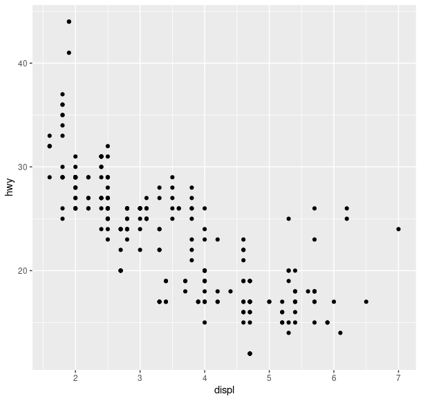

```{r eval=FALSE}
# Supondo que gostaríamos de utilizar diferentes cores para
# distinguir entre os 3 subconjuntos (fatores) tipos de
# movimentação (drv) bastaria colocar um novo argumento,
# conhecido como estética. Neste caso, cor, e definir igual a
# drv
qplot(displ, hwy, data = mpg, color = drv)
```

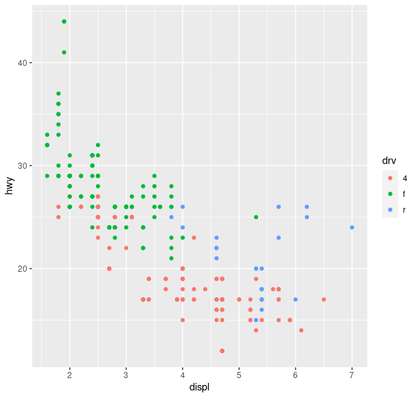

Utilizando o argumento geom (que se refere aos objetos geométricos) podemos especificar pontos, formas e até mesmo o tipo de gráfico que será plotado. Agora vamos construir um boxplot utilizando a função `qplot()`.
```{r eval=FALSE}
# Primeiro especificamos a variável na qual queremos dividir
# os dados (drv), para então em seguida, especificar a
# variável na qual queremos examinar, neste caso hwy. O
# terceiro argumento se refere ao dado (=mpg) e o quarto,
# geom definido como a string 'boxplot'
qplot(drv, hwy, data = mpg, geom = "boxplot")
```

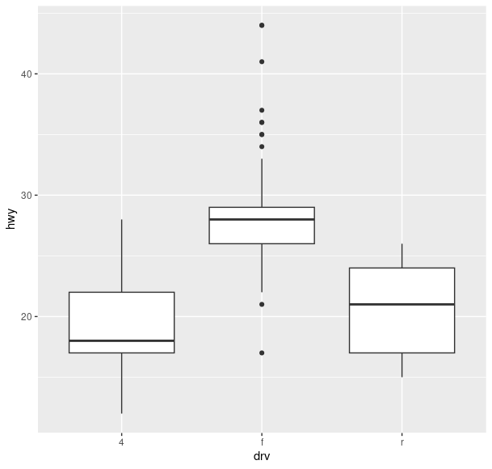

Com o código acima pudemos visualizar 3 boxes, um para cada tipo de movimentação. No entanto, podemos definir com cores, para cada marca, basta colocar um outro argumento ao código anterior, color igual a manufacturer.
```{r eval=FALSE}
qplot(drv, hwy, data = mpg, geom = "boxplot", color = manufacturer)
# note que ainda temos 3 regiões nos gráficos,
# correspondentes aos 3 tipos de movimentação, e em cada
# temos subdivisões de acordo com as marcas
```

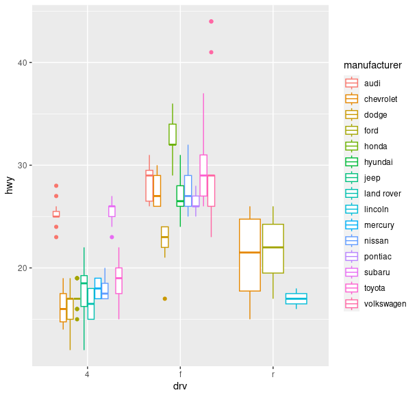

Agora depois de ver um pouco sobre a função `qplot()` iremos focar em alguns componentes fundamentais do pacote ggplot2. Para montar gráficos utilizando a função `ggplot()` vamos fazer em uma série de etapas. Isto com o intuito de analisar o que está acontecendo em cada passo até a obtenção do gráfico final. Primeiro iremos criar uma variável “g” e designar à esta uma chamada a função ggplot com 2 argumentos. O primeiro se refere a mpg (nosso data set em questão) e o segundo dirá a ggplot o que queremos plotar, que neste caso são as variáveis displ e hwy. Como estas se tratam das estéticas que queremos representar, passamos as mesmas como argumentos na função `aes`.
```{r eval=FALSE}
g <- ggplot(mpg, aes(displ, hwy))

# o que ggplot fez foi criar um objeto gráfico o qual
# designamos àvariável g O pacote ggplot2 precisa saber como
# os dados serão visualizados, logo épreciso especificar.
# Para criar um gráfico de pontos, podemos fazer por exemplo

g + geom_point()
# ao fazer chamada para a função geom_point() foi adicionada
# uma camada ao objeto gráfico. Perceba que você nao precisou
# passar nenhum argumento para a função geom_point(), isto
# porque o objeto g já possui todo o dado armazenado nele.
# Vamos agora adicionar outra camada, fazendo uma chamada
# para a função geom_smooth

g + geom_point() + geom_smooth()
# A sombra cinza ao redor da linha azul éo intervalo de
# confiança. Épossível utilizar uma função diferente de
# suavização, definindo método igual àlm (method = 'lm')
```

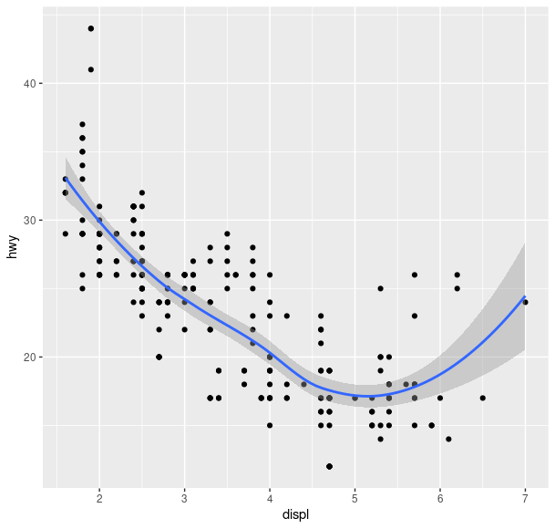

Além das definições padrões, podemos adicionar outras anotações utilizando funções como `xlab()`, `ylab()` e `ggtitle()`. Vamos fazer um exemplo adicionando um título ao gráfico. Como por exemplo “Meu GGPlot”.
```{r eval=FALSE}
g + geom_point() + geom_smooth(method = "lm") + ggtitle("Meu GGPlot")

# Podemos mudar outras estéticas do gráfico, ao definir cores
# e tamanhos, por ex:
g + geom_point(color = "pink", size = 4, alpha = 1/2)

# os diferentes tons de rosa são resultado do argumento
# alpha, que diz o quão transparentes os pontos precisam ser.
# Os círculos mais escuros indicam que há múltiplos pontos
```

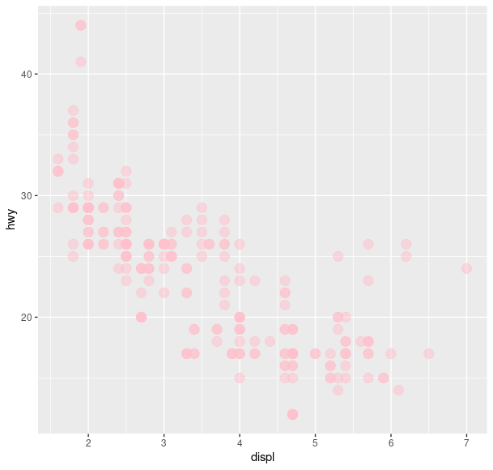

```{r eval=FALSE}
g + geom_point(aes(color = drv)) + theme_bw(base_family = "Times")
```

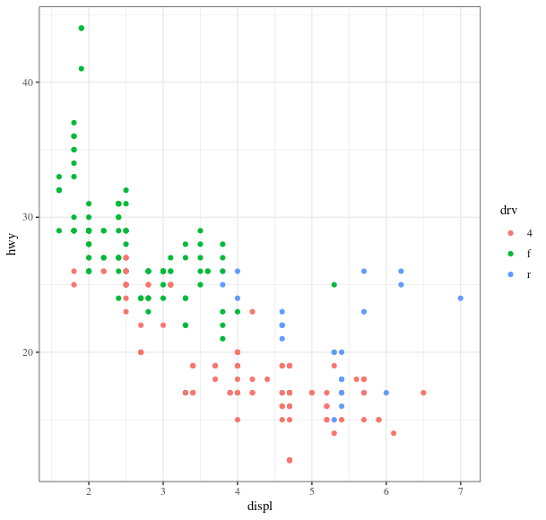

### Exemplos com os dados de tumor de mama de Wiscosin
Nos exemplos abaixo, iremos utilizar novamente o data set com informações sobre nódulos de mama de Wiscosin. Vamos gerar gráficos utilizando as funções básicas do R e do GGplot. Alteramos algumas variáveis dos gráficos para apresentar algumas possibilidade de customização.
```{r}
# Vamos baixar os dados de características de nódulos de mama de Wiscosin
# Mais informações sobre esse dataset em https://archive.ics.uci.edu/ml/datasets/Breast+Cancer+Wisconsin+%28Diagnostic%29
download.file(url = 'https://archive.ics.uci.edu/ml/machine-learning-databases/breast-cancer-wisconsin/wdbc.data',destfile = "wbdc.data")

# Vamos importar os dados para o ambiente do R.
# Os dados estão separados por vírgula, por isso o argumento sep=','
# outras opções e argumentos podem ser vistos em help(read.table)
brca <- read.table(file = "./wbdc.data", sep = ',')
colnames(brca) <- c('id_number', 'diagnosis', 'radius_mean',
                    'texture_mean', 'perimeter_mean', 'area_mean',
                    'smoothness_mean', 'compactness_mean',
                    'concavity_mean','concave_points_mean',
                    'symmetry_mean', 'fractal_dimension_mean',
                    'radius_se', 'texture_se', 'perimeter_se',
                    'area_se', 'smoothness_se', 'compactness_se',
                    'concavity_se', 'concave_points_se',
                    'symmetry_se', 'fractal_dimension_se',
                    'radius_worst', 'texture_worst',
                    'perimeter_worst', 'area_worst',
                    'smoothness_worst', 'compactness_worst',
                    'concavity_worst', 'concave_points_worst',
                    'symmetry_worst', 'fractal_dimension_worst')
brca$diagnosis <- as.factor(brca$diagnosis)
# Adicionar coluna com a razão do perímetro pelo raio dos nódulos
brca$perimeter.radius <- brca$perimeter_mean/brca$radius_mean
```

**Histogramas**
```{r eval=FALSE}
# Pacote básico
# Em hist() por padrão usa-se contagem.
# Para densidade, mudar argumento freq = F
hist(brca$radius_mean, breaks = 20, col = "aquamarine",
     border = "dodgerblue4",
     xlab = "radius_mean", ylab = "Densidade",
     main = "Raio médio de nódulos de mama",
     freq = F)
```

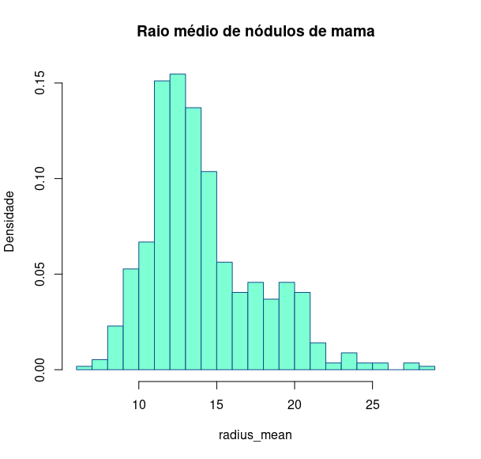

```{r eval=FALSE}
# Adicionar linha com a densidade
lines(density(brca$radius_mean), col = "red")
```

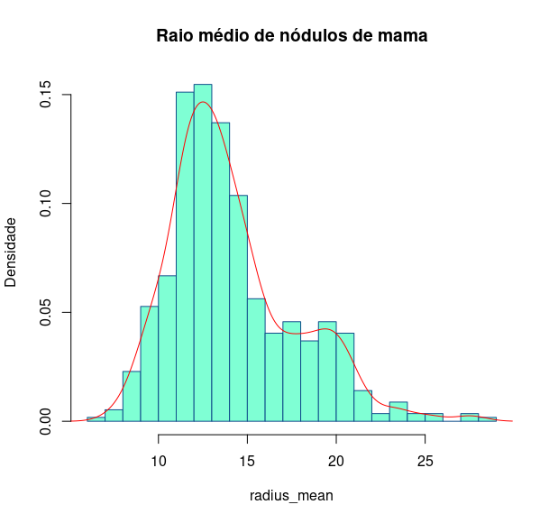

```{r eval=FALSE}
# Salvar gráfico em PDF
# https://r-coder.com/save-plot-r/
# Nesse link tem outras opções (ex.; svg, pdf, jpeg, bmp, tiff)
pdf(file = "./Meuplot.pdf")
hist(brca$radius_mean, breaks = 20, col = "aquamarine",
     border = "dodgerblue4",
     xlab = "Raio médio", ylab = "Densidade",
     main = "Raio médio de nódulos de mama", freq = F)
lines(density(brca$radius_mean), col = "red")
dev.off()
```


```{r eval=FALSE}
# GGplot2
g <- ggplot(data = brca, aes(radius_mean)) +
  geom_histogram(bins = 20, color = "dodgerblue4", fill = "aquamarine",
                 aes(y = ..density..)) +
  geom_density(color = "red") +
  labs(title = "Raio médio de nódulos de mama")
g
```

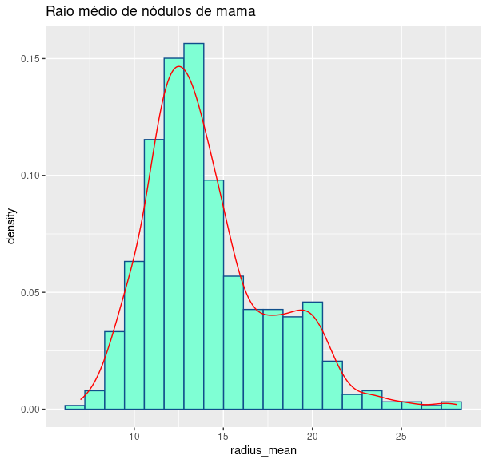

```{r eval=FALSE}
# Mudando o tema e adicionando subtítulo
g + theme_dark() +
  labs(subtitle = "Dados de Wiscosin")
```

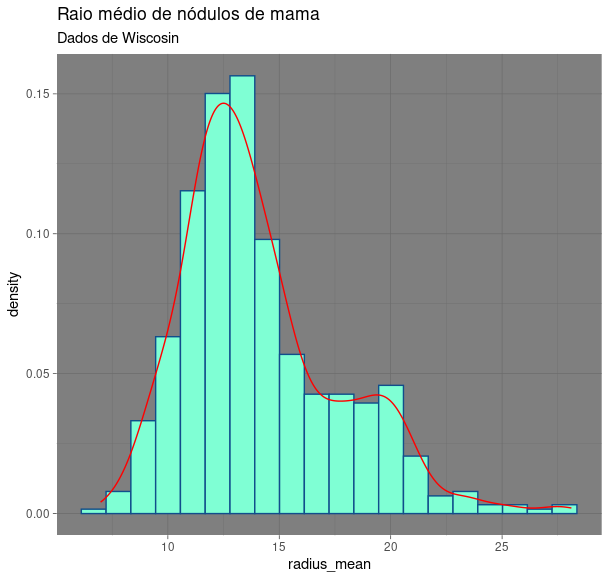

```{r eval=FALSE}
# R base
plot(brca$radius_mean, brca$perimeter_mean, pch = 15,
     xlab = "Raio médio", ylab = "Perímetro médio",
     col = brca$diagnosis)
# Adicionar legenda
# https://statisticsglobe.com/add-legend-to-plot-in-base-r
legend("topleft", legend = c("B","M"),
       col = 1:2, pch = 15)
```

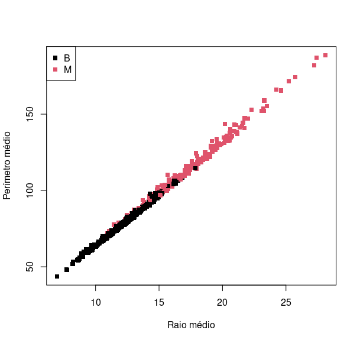


```{r}
# GGplot2
# Criando variável categórica para area
# Vamos utilizá-la para alterar a forma dos pontos no gráfico
summary(brca$area_mean)
brca$Area <-
  ifelse(brca$area_mean < 420,
         "Baixo",
         ifelse(brca$area_mean < 750, "Intermediário", "Alto"))
brca$Area <- factor(brca$Area,
                    levels = c("Baixo", "Intermediário", "Alto"))
```


```{r eval=FALSE}
# Agora os comandos para o gráfico em si
ggplot(data = brca,
       aes(x= radius_mean, y = perimeter_mean,
           color = diagnosis, shape = Area))+
  geom_point()+
  labs(x = "Raio médio",
       y = "Perímetro médio",
       color = "Diagnóstico",
       shape = "Área")+
  scale_fill_discrete(labels = c("Benigno", "Maligno"))
```

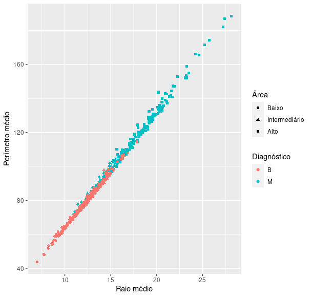

**Gráfico de barras**
```{r eval=FALSE}
# Gráfico de barras
# http://www.sthda.com/english/wiki/bar-plots-r-base-graphs

# R base
table(brca$Area)
counts <- table(brca$Area)
barplot(counts, col = c("green", "orange", "red"))
```

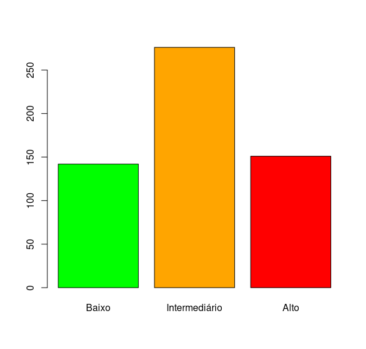

```{r eval=FALSE}
# Ggplot2
# http://www.sthda.com/english/wiki/ggplot2-barplots-quick-start-guide-r-software-and-data-visualization
ggplot(brca,
       aes(Area)) +
  geom_bar(stat="count", aes(fill=Area))
```

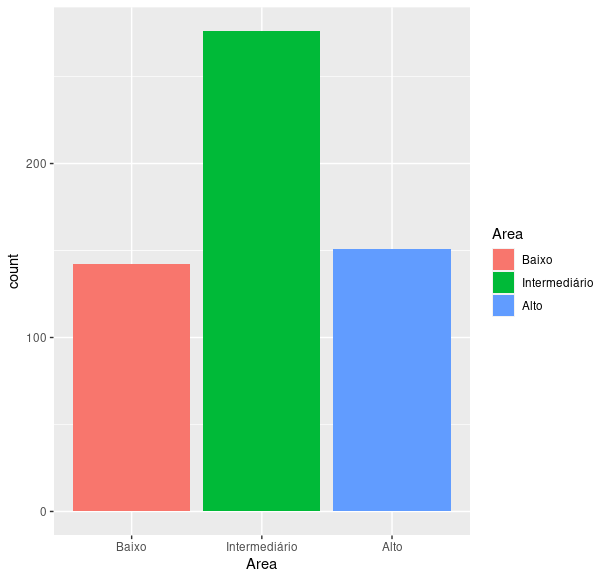

**Boxplot**
```{r eval=FALSE}
# R base
# https://statisticsglobe.com/boxplot-in-r
# '~' éum operador para fórmular no R
# Significa "depende de"
# A aplicação évar_dep ~ var_ind
boxplot(brca$radius_mean ~ brca$diagnosis,
        horizontal = T, las = 1,
        main = "Raio médio e malignidade",
        col = c("lightblue", "mistyrose"),
        xlab = "Raio médio", ylab = "")
```

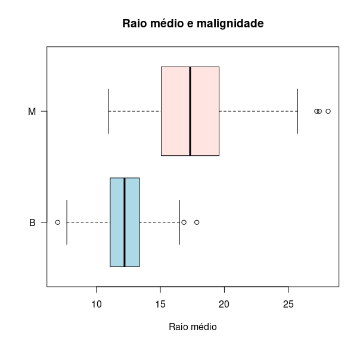

```{r eval=FALSE}
# GGplot2
# Criar boxplot e ajustar legenda
# https://r-charts.com/ggplot2/legend/
g <- ggplot(data = brca,
            aes(x= diagnosis, y = radius_mean, fill = diagnosis))+
  geom_boxplot(width = 0.3) +
  labs(x = "Diagnóstico",
       y = " Raio médio",
       fill = "Legenda") +
  scale_x_discrete(labels = c("BENIGNO", "MALIGNO")) +
  scale_fill_discrete(labels = c("Benigno", "Maligno"))+
  theme(legend.position = "bottom")
g
```

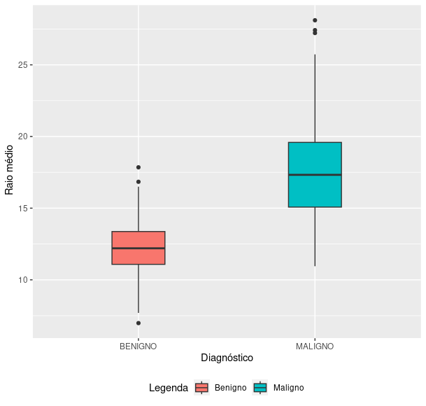

```{r eval=FALSE}
# Adicionar violion plot
g <- g + geom_violin(alpha = 0.2)
g
```

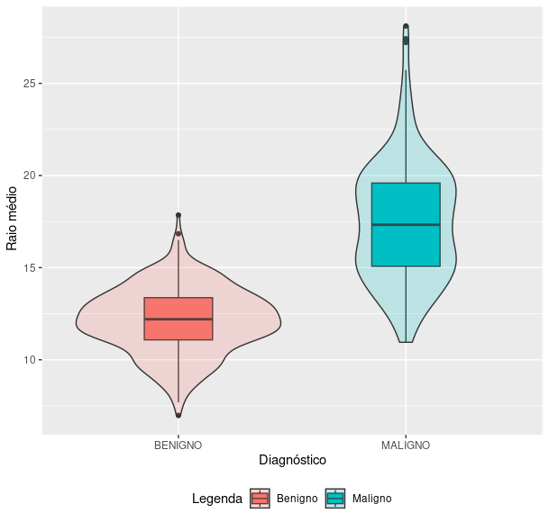

```{r eval=FALSE}
# Para adicionar teste estatístico
# http://sthda.com/english/articles/24-ggpubr-publication-ready-plots/76-add-p-values-and-significance-levels-to-ggplots/
# Instalar pacote ggpubr caso não esteja instalado
install.packages("ggpubr")
# Carregar pacote
library("ggpubr")
# Adicionar teste estatístico ao gráfico
g +
stat_compare_means(method = "t.test", label = "p.signif",
comparisons = list(c("B", "M")))
```

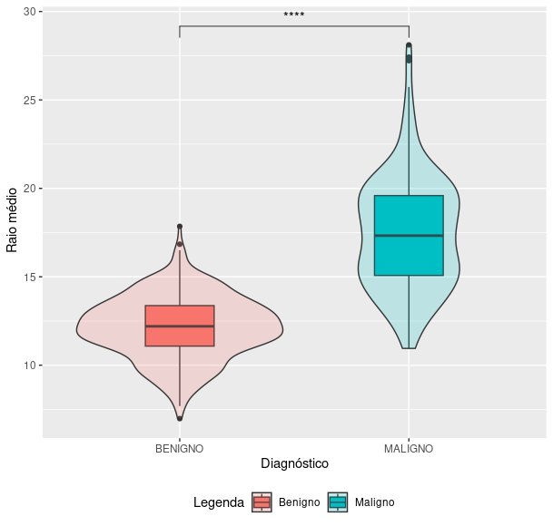

## Bonus track - Gráficos interativos com plotly
O pacote plotly é uma forma bastante simples de se produzir gráficos interativos. Ele apresenta uma sintaxe própria que pode ser aprendida nas descrições das funções, no site oficial do pacote (https://plotly.com/r/) ou em vários tutoriais online. Aqui vamos apenas apresentar uma facilidade que o pacote traz a qual é sua compatibilidade com gráficos gerados pelo ggplot2. A função ggplotly() recebe um gráfico do ggplot e torna-o interativo. Essa função é compatível com a maior parte dos recursos do ggplot, apesar de existirem algumas poucas exceções. Além disso, os gráficos interativos gerados pelo plotly são compatíveis com o pacote shiny, podendo ser usado em dashboards e web apps. Abaixo vamos apresentar 2 exemplos simples transformando gráficos gerados com o ggplot em interativos.
```{r}
#install.packages("plotly")
library(plotly)

# Criando um histograma com ggplot
g<-ggplot(data = brca, aes(radius_mean)) +
  geom_histogram(bins = 20, color = "dodgerblue4", fill = "aquamarine",
                 aes(y = ..density..)) +
  geom_density(color = "red") +
  labs(title = "Raio médio de nódulos de mama",
       x = "Raio médio",
       y = "Densidade",
       subtitle = "Dados de Wiscosin")+
  theme(axis.title.y = element_text(face = "bold", color= "red"),
        panel.background = element_rect(fill = "lightblue"))

# Tornando-o interativo:
ggplotly(g)

# Barplot
ggplotly(ggplot(brca,
                aes(Area)) +
           geom_bar(stat="count", aes(fill=Area)))

# Você pode testar com os demais exemplos que criamos na seção anterior
# Crie seu gráfico no ggplot e insira dentro da função ggplotly.
# Perceba que as funções do ggpubr (de comparação estatística)
# ainda não são suportados pelo plotly

ggplotly(ggplot(mpg, aes(x=cyl, y=hwy, fill=as.factor(cyl), group=cyl))+
           geom_boxplot())
summary(as.factor(mpg$cyl))
```

## Lista de exercícios 02
1. Utilizando o data set mpg: como você plotaria a relação entre as variáveis cty (a milhagem média da cidade) e hwy (a quilometragem média da rodovia)? Como você descreveria essa relação?

2. Para adicionar variáveis a um gráfico precisamos mapeá-las em estéticas. Em duas dimensões, podemos usar os eixos x e y. Para adicionar uma terceira (ou quarta, etc) variável precisamos utilizar estéticas tais como forma, cor e tamanho. Utilizando o data set mpg, plote um gráfico de pontos usando a função ggplot, mostrando a relação entre as variáveis displ, hwy e drv. Dica: como se tratam de mais de duas variáveis, use a estética shape para representar drv.

3. Continuando a usar o data set mpg, vamos primeiro ver como fica a distribuição dos dados de milhas rodadas na cidade por galões de combustível (cty). Para isso, crie um histograma básico com a variável cty, use o argumento breaks = 10. Os valores se concentram ao redor de qual número?

4. Agora vamos investigar como o consumo urbano se comporta dependendo da classe do
carro. Crie um boxplot onde o eixo x serão as classes dos carros (class) e no eixo y a quantidade de milhas que o carro faz por galão de combustível (cty). Valores mais altos em cty indicam carros que gastam menos combustível. Quais as 2 classes mais econômicas na cidade (maiores valores em cty)? Quais as 2 classes que mais consomem combustível na cidade (menores valores em cty)?